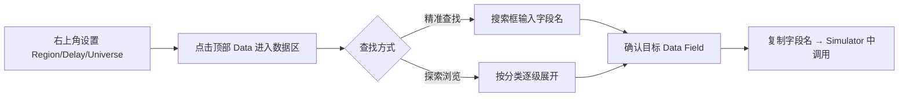

# 常用数据附表

## 文档结构概览
- 1. 数据集（Datasets）介绍
- 2. PV数据集详解
- 3. 操作符（Operators）介绍
- 4. 常用数据附表
- 5. Universe 概念与评估

---

## 1. 数据集（Datasets）介绍

## 1. 数据集（Datasets）介绍

BRAIN 通过预定义的名称，让用户能够轻松访问金融市场数据。在本步骤中，我们将学习如何找到你想要的数据。首先，让我们了解 BRAIN 中的数据分类体系。

### 1.1 数据分类层级
>数据集类别（Dataset Categories）
>
>数据集（Datasets）
>
>数据字段（Data fields）

### 🏷️ 数据集类别（Dataset Categories）
数据集类别将数据划分为 17 个主要类别。你可以通过点击平台屏幕顶部的 "Data" 菜单查看这些类别。（在成为顾问之前，BRAIN 仅显示 7 个类别。）典型示例包括：来自公司财务报表的 **Fundamental（基本面）数据**，以及与股价和交易量相关的**PV（价量）数据**。

### 📦 数据集（Datasets）
数据集是具有相同主题的数据集合。它们通常通过在数据集类别名称后添加数字来命名。例如：<br>
`PV1` 数据集：包含股票市场的价量相关数据，如开盘价、最高价、最低价、收盘价，以及 20 日平均交易量等信息。<br>
`fundamental6` 数据集：提供财务报表中的大量数据，包括公司资产、资本和负债等。

### 🔢 数据字段（Data fields）
数据字段是平台中实际使用的矩阵形式数据。你可以通过字段名称在模拟器（Simulator）中访问数据字段的内容。我们之前使用的 `returns` 数据，就是访问了包含收益率信息的数据字段。

### 🔍 查找所需数据
BRAIN 提供 **Data Section（数据区）** 来查找所需的数据字段。你可以：
 - 按数据集名称或数据字段名称进行搜索
 - 或从分类层级逐级浏览探索

---

### 1.2 核心概念

#### 三层数据架构
```
🗂️ Dataset Categories（17大类）
        ↓
📦 Datasets（主题数据集：类别名+数字）
        ↓
🔢 Data Fields（具体数据字段：矩阵型数据单元）
```

##### 1.2.1 Dataset Categories（数据集类别）
| 要点 | 说明 |
|----------|----------|
| 数量 | 共 17 个主类别（非顾问用户仅可见 7 个） |
| 入口 | 平台顶部菜单栏 → 点击 "Data" |
| 作用| 按业务领域对金融数据进行一级分类 |
| 典型示例 | `Fundamental`（基本面）、`PV`（价量） |

##### 1.2.2 Datasets（数据集）
| 要点 | 说明 |
|----------|----------|
| 定义 | 同一主题下的数据集合 |
| 命名规则 | `类别名 + 数字序号`（如 PV1、fundamental6） |
| PV1 示例| 开盘价、最高价、最低价、收盘价、20 日均量等 |
| fundamental6 示例 | 资产、资本、负债、利润表、现金流量表等财务指标 |

##### 1.2.3 Data Fields（数据字段）⭐ 核心使用单元
| 要点 | 说明 |
|----------|----------|
| 本质 | 平台中可直接调用的矩阵型数据（时间×股票） |
| 调用方式 | 在 Simulator 中通过字段名称字符串直接引用 |
| 示例| `returns` → 获取收益率序列；`close` → 获取收盘价序列 |
| 特点 | 字段名是代码中唯一标识，需准确记忆或查询 |

#### 🔍 查找数据字段的两种路径
```bash
✅ 路径一：关键词搜索
   Data 区 → 搜索框输入 Dataset 或 Field 名称 → 精准定位
✅ 路径二：分类浏览
   Data → 选类别 → 选数据集 → 展开字段列表 → 逐级筛选
```

#### ⚠️ 关键前置配置（❗易错点）
搜索或浏览前，必须在页面右上角确认以下三项：

| 配置项 | 可选示例 | 影响范围 |
|----------|----------|----------|
| 🌍 Region（区域） | US / CN / HK / JP | 决定数据源市场（如美股/赵股）|
| ⏱️ Delay（延迟） | Real-time / 15min / End-of-Day | 影响数据实时性与权限要求 |
| 🎯 Universe（股票池）| S&P500 / CSI300 / All Stocks | 限制可访问的股票范围 |
>💡 重要原则：同一字段名在不同 Region/Universe 下可能代表不同内容，或根本不可用！

#### 🧭 标准操作流程（SOP）


---

## 2. PV数据集详解
**PV 数据（价量数据）** 包含与价格和成交量相关的信息。由于它包含了价格本身（这对预测股价至关重要），因此在初次创建 Alpha 因子时，它是最有用的数据类型之一。

### 💵 价格数据 (Price data)
**PV 数据** 包含股票价格——开盘价 (Open)、最高价 (High)、最低价 (Low)、收盘价 (Close)——以及其他交易相关信息，如成交股数 (Volume) 和市值 (Market Capitalization)。这些数值在 K 线图（蜡烛图）中得到了很好的体现。

**K 线图要素定义：**


 - **Open (开盘价)** ：股市当日开盘时的第一笔成交价格。
 - **Close (收盘价)** ：股市当日收盘时的最后一笔成交价格。
 - **High (最高价)** ：当日交易中的最高成交价格。
 - **Low (最低价)** ：当日交易中的最低成交价格。

### 📦 成交量 (Volume)
**成交量 (Volume)** 表示投资者当日交易的股票数量。

*   你可以使用 `adv20` 数据字段来访问 **20日平均成交量**。
*   如果你想计算不同天数的平均值，可以使用 `ts_mean(volume, N)`。

### 📋 VWAP (成交量加权平均价)
此外，**VWAP** 可以代表一天的股票价格，即成交量加权平均价。
由于低成交量的交易可能会给其他价格指标（如收盘价）带来虚假的表象，**VWAP** 可能是衡量当日价格的更好指标。让我们看这张表：

| Price (价格) | Volume (成交量) |
| :---: | :---: |
| 10 | 100 |
| 11 | 120 |
| 12 | 80 |
| 13 | 10 |
| **VWAP** | **11** |

在这里，VWAP 是 11，这是通过将“价格乘以成交量的总和”除以“总成交量之和”得出的。
用公式表示，即 `sum(price*volume)/sum(volume)`。

### 💡 Alpha 构思 (Alpha Ideas)
大多数使用 PV 数据的 Alpha 因子源于以下两个主要理念：

1.  **动量 (Momentum)**
    *   假设过去表现良好的股票将继续表现良好，而过去表现不佳的股票将继续表现不佳。
    *   **动量效应 (Momentum effect)** 通常出现在较长的时间段内（几个月或更久）。
2.  **反转 (Reversion)**
    *   假设是：如果某事物今天上涨，明天就会下跌。如果今天下跌，明天就会上涨。
    *   这个“某事物”可以是任何东西：价格、成交量、两者之间的相关性，或者你在开发 Alpha 时能想到的其他指标/变量。
    *   **反转效应 (Reversion effect)** 出现在较短的时间段内（几天或几周）。

我们最初创建的 `rank(-returns)` 就是实施反转效应的一个简单示例。

---
### 1️⃣ PV 数据核心要素
PV 数据（Price & Volume）是量化策略最基础的数据源。

| 类别 | 字段/概念 | 说明 |
| :--- | :--- | :--- |
| **价格 (Price)** | `open` | 开盘价（当日第一笔成交价） |
| | `high` | 最高价 |
| | `low` | 最低价 |
| | `close` | 收盘价（当日最后一笔成交价） |
| **成交量 (Volume)** | `volume` | 当日成交股数 |
| | `adv20` | 20日平均成交量 (Average Daily Volume) |
| | `ts_mean(vol, N)` | 自定义 N 日平均成交量 |
| **综合指标** | `vwap` | 成交量加权平均价 (更能反映真实交易成本) |

#### 2️⃣ VWAP (成交量加权平均价)
 - **定义**：当日总成交金额 / 当日总成交量。
 - **公式**：

    $$ VWAP = \frac{\sum (Price_i \times Volume_i)}{\sum Volume_i} $$

 -  **优势**：相比收盘价，VWAP 能过滤掉低成交量造成的价格失真（例如尾盘少量资金拉升股价），更能代表当日市场的平均持仓成本。

#### 3️⃣ 两大 Alpha 策略逻辑

| 策略类型 | 核心假设 | 时间周期 | 典型特征 | 示例代码逻辑 |
| :--- | :--- | :--- | :--- | :--- |
| **动量 (Momentum)** | 强者恒强，弱者恒弱 | 长周期 (数月) | 追涨杀跌 | `rank(returns)` (做多高收益) |
| **反转 (Reversion)** | 涨多了会跌，跌多了会涨 | 短周期 (数天/周) | 高抛低吸 | `rank(-returns)` (做空高收益/做多低收益) |

#### 4️⃣ 常用函数速查
*   **时间序列平均**：`ts_mean(x, d)` -> 计算 x 在过去 d 天的平均值。
*   **横截面排名**：`rank(x)` -> 将 x 在当日所有股票中排序并归一化到 [0, 1]。
*   **负号运算**：`-returns` -> 将收益率取反，用于构建反转策略（收益率越高，得分越低）。

## 3. 操作符（Operators）介绍

### 在BRAIN中使用操作符（Operators）

就像我们之前对 `-returns` 应用 `rank()` 来转换矩阵中的值一样，**操作符（Operators）** 用于处理数据字段中的矩阵数据。BRAIN 提供了多种操作符，包括简单的算术运算和更复杂的处理函数。

---

#### 3.1 算术运算符（Arithmetic Operators）

算术运算符支持执行算术运算，包括基础数学运算和取整操作。

> 示例：`+`、`-`、`*`、`/`、`round()` 等

---

#### 3.2 逻辑运算符（Logical Operators）

逻辑运算符用于评估表达式，并返回 **真（true）** 或 **假（false）** 的值。在 BRAIN 中：
- `true` = `1`
- `false` = `0`

> 示例：`x > 0`、`x == y`、`and`、`or`、`not`

---

#### 3.3 时间序列运算符（Time Series Operators）

时间序列运算符对**单只股票**的**历史 d 天数据**进行操作。

> 示例：`ts_mean(x, d)` → 计算 x 在过去 d 天的平均值  
> 其他：`ts_sum()`、`ts_std()`、`ts_rank()`、`delay()`、`ts_max()` 等

---

#### 3.4 横截面运算符（Cross Sectional Operators）

横截面运算符在**特定时间点**，对**目标股票池内所有股票**的值进行比较或处理。

> 示例：`rank(x)` → 在某一时刻对所有股票的 x 值排序，并映射到 [0, 1] 区间  
> 其他：`scale()`、`neutralize()`、`cs_rank()` 等

---

#### 3.5 向量运算符（Vector Operators）

在搜索数据字段时，你可能会发现**向量型（vector-type）数据字段**。这类字段的特点是：
- ❌ 不是每只股票每天对应**单个值**
- ✅ 而是存储**多个值**（以向量格式）

要将这类数据用于 Alpha 策略，需要先将其转换为**单一代表值**（如均值、中位数等）。向量运算符就是为此目的设计的。

> 示例：`vector_mean()`、`vector_median()`、`vector_std()`

---

#### 3.6 转换运算符（Transformational Operators）

转换运算符通过特定操作，对矩阵内部的数值进行变换处理。

> 示例：`log()`、`exp()`、`abs()`、`sign()`、`cut()`、`top_rank()` 等

---

#### 3.7 群组运算符（Group Operators）

在探索数据字段时，你可能会发现**群组型（group-type）数据字段**，这类字段按照特定标准对公司进行分组。

> 示例：`industry` 字段 → 按行业对公司分类

群组运算符支持两类核心操作：
1. **组内聚合**：计算组内的代表值（均值/总和/中位数等）
2. **组内中性化**：消除组间系统性差异，保留组内相对强弱

> 示例：`group_mean(x, group)`、`group_neutralize(x, group)`

---

### 3.8 核心概念

#### 🔑 核心概念：操作符 = 矩阵处理器

> 所有操作符的输入输出本质都是 **矩阵（时间×股票）**，操作符对矩阵进行变换、计算或筛选，最终生成可用于策略的信号矩阵。

```
数据字段（矩阵） → [操作符处理] → 新矩阵 → Alpha信号
```

---

#### 🗂️ 七大操作符类型速查表

| 类型 | 英文 | 核心作用 | 典型示例 | 适用场景 |
|------|------|----------|----------|----------|
| ➗ 算术运算符 | Arithmetic | 基础数学运算 | `x + y`, `round(x)` | 数值计算、单位转换 |
| 💡 逻辑运算符 | Logical | 条件判断，返回0/1 | `x > 0`, `and`, `or` | 信号筛选、条件触发 |
| ⏰ 时间序列运算符 | Time Series | 单股票历史窗口计算 | `ts_mean(x,5)`, `delay(x,1)` | 动量、波动率、滞后特征 |
| ❌ 横截面运算符 | Cross Sectional | 同一时刻股票间比较 | `rank(x)`, `scale(x)` | 排名、标准化、相对强弱 |
| 📐 向量运算符 | Vector | 向量→标量聚合 | `vector_mean(v)`, `vector_median(v)` | 处理多值字段（如订单簿） |
| 🎭 转换运算符 | Transformational | 数值变换/分布调整 | `log(x)`, `abs(x)`, `cut(x, bins)` | 去偏、非线性变换、分箱 |
| 👪 群组运算符 | Group | 组内聚合/中性化 | `group_mean(x, industry)`, `group_neutralize(x, group)` | 行业中性、风格控制 |

---

#### 🔍 关键区分：时间序列 vs 横截面运算符 ⭐

| 维度 | 时间序列运算符（TS） | 横截面运算符（CS） |
|------|---------------------|-------------------|
| 🎯 操作对象 | **单只股票**的历史数据 | **多只股票**的同一时刻数据 |
| 📅 时间维度 | 沿时间轴滑动窗口 | 固定时间点切片 |
| 📊 空间维度 | 不涉及股票间比较 | 股票池内横向比较 |
| 🧮 示例 | `ts_mean(close, 20)` → 20日均线 | `rank(close)` → 当日收盘价排名 |
| 💡 记忆口诀 | **"纵向看历史"** | **"横向比高低"** |

---

#### 🧩 操作符组合使用示例

```python
# 示例1：行业中性动量因子
# 步骤：计算20日收益率 → 行业内排名 → 中性化处理
momentum = ts_mean(returns, 20)
ranked = group_rank(momentum, industry)
alpha = group_neutralize(ranked, industry)

# 示例2：波动率过滤的强势股筛选
# 步骤：计算波动率 → 逻辑判断 → 横截面排名
vol = ts_std(returns, 10)
low_vol = vol < ts_mean(vol, 60)  # 逻辑运算符返回0/1
strong = rank(returns) * low_vol  # 仅对低波动股票排名
```

---

#### ⚠️ 使用注意事项

| 问题 | 说明 | 解决方案 |
|------|------|----------|
| 🔢 维度不匹配 | 向量字段不能直接用于标量运算 | 先用 `vector_*` 运算符聚合 |
| 🧭 组字段缺失 | 使用 `group_*` 运算符需指定有效 group 字段 | 确认 `industry`/`sector` 等字段已加载 |
| ⏳ 时间对齐 | `delay(x, d)` 会引入前瞻性偏差 | 回测时确保信号生成时间 ≤ 交易时间 |
| 📉 空值传播 | 操作符对 NaN 的处理可能影响结果 | 用 `fillna()` 或 `dropna()` 预处理 |
| 🔄 运算顺序 | 多个操作符嵌套时注意优先级 | 用括号 `()` 明确计算顺序 |

---

#### 🧭 操作符选择决策树

```
你想对数据做什么？
│
├─ 🔢 数值计算？ → ➗ 算术运算符
│
├─ ✅ 条件判断？ → 💡 逻辑运算符  
│
├─ 📅 看历史趋势？ → ⏰ 时间序列运算符
│   └─ 单股票窗口统计 → ts_mean / ts_std / ts_rank
│
├─ 📊 股票间比较？ → ❌ 横截面运算符
│   └─ 排名/标准化 → rank / scale / neutralize
│
├─ 📦 处理多值字段？ → 📐 向量运算符
│   └─ 向量→标量 → vector_mean / vector_median
│
├─ 🎯 数值变换？ → 🎭 转换运算符
│   └─ 去偏/分箱 → log / abs / cut
│
└─ 👥 按组处理？ → 👪 群组运算符
    └─ 行业中性/组内聚合 → group_mean / group_neutralize
```

---

#### 📝 快速记忆卡

> 🎯 **操作符使用三原则**：
> 1. **先辨维度**：输入是标量/向量/矩阵？时间序列还是横截面？
> 2. **再选类型**：按目标操作选择对应操作符类别
> 3. **最后组合**：嵌套使用时注意运算顺序和维度对齐

> 💡 **口诀**：  
> **"算术逻辑打基础，时序横截分纵横；  
> 向量转换做加工，群组中性控风险。"**

---

## 4. 常用数据附表
### 常用算子速查

| 类别 | 算子 | 示例 | 说明 |
|----------|----------|------|----|
| 横截面 | `rank(x)` | `rank(close)` | 全市场排序 |
| 时间序列 | `ts_mean(x, d)` | `ts_mean(returns, 5)` | d日移动平均 |
| 时间序列| `ts_std_dev(x, d)` | `ts_std(returns, 20)` | d日标准差 |
| 时间序列 | `ts_rank(x, d)` | `ts_rank(volume, 10)` | d日内排名 |
| 延迟 | `ts_delay(x, d)` | `delay(close, 1)` | d日前数值 |
| 变化率 | `ts_delta(x, d)` | `delta(close, 1)` | 与d日前差值 |
| 条件 | `if_else(c, t, f)` | `if_else(returns>0, volume, 0)` | 条件判断 |

### 常用数据字段
| 类别 | 字段 | 说明 |
|----------|----------|------|
| 价格 | `close` | 收盘价 |
| 价格 | `open` | 开盘价 |
| 价格| `high/low` | 最高/最低价 |
| 收益率 | `returns` | 日收益率 |
| 成交量 | `volume` | 成交量 |
| 市值 | `market` | 市值 |

### 合格 Alpha 标准
| 指标 | 最低要求 | 理想值 |
|----------|----------|------|
| Sharpe Ratio | > 1.0 | > 1.5 |
| Turnover | < 0.7 | < 0.4 |
| Fitness| 	> 0.3 | > 0.5 |
| Returns | > 0 | > 5% |
| Drawdown | < 15% | < 10% |

---

## 5. Universe 概念与评估

### 5.1 "Universe"的定义与核心特征

定义：在WorldQuant BRAIN平台中，“Universe”指一个预定义的股票集合，通常基于股票的流动性（交易量）和市值进行筛选和排名。
命名规则：TOP[N]，其中 N 代表该Universe中包含的股票数量。例如：

TOP3000：交易量最大的3000只股票。
TOP1000：交易量最大的1000只股票。
TOP200：交易量最大的200只股票。


核心规律：Universe数字越小，其包含的股票流动性越强、市值越大、交易越活跃。TOP200 是“小Universe”，但代表的是“大公司”。

### 5.2 不同Universe对Alpha信号的直接影响

信号强度递减：课程明确指出，在较小的Universe（如TOP200）中，Alpha信号往往相对较弱。
根本原因：

信息效率高：大市值、高流动性的股票，市场关注度高，信息传播和消化速度极快，任何定价错误被套利的速度也更快，因此获取超额收益（Alpha）的难度更大。
竞争更激烈：这些股票是众多机构投资者和量化基金的必争之地，策略同质化可能更严重。


实践意义：一个只在TOP3000有效，但在TOP500失效的Alpha，可能主要依赖于对小盘股、低流动性股票的挖掘，其实际可交易的容量和稳健性存疑。

### 5.3 核心评估工具：子Universe测试

测试目的：评估Alpha的稳健性与实践可行性。
测试方法：将Alpha在逐渐缩小的Universe（如TOP3000 -> TOP1000 -> TOP500 -> TOP200）中进行回测，观察其表现（如夏普比率）是否能够维持。
通过标准：一个优秀的、稳健的Alpha应该在多个Universe，尤其是较小的、高流动性的Universe中，都能产生持续的正向信号。
未通过的启示：如果Alpha在小子Universe中失效，说明其收益来源可能无法在高效、高容量的市场中复制。改进方向可能是调整策略，使其逻辑更适用于大盘股（例如，使用更长期的数据、不同的参数或结合其他因子）。

### 5.4 策略多样性与Universe选择

降低相关性：在不同Universe中表现良好的Alpha，其收益来源可能不同（例如，一个擅长捕捉大盘股动量，另一个擅长挖掘中小盘股价值）。将它们组合起来，可以降低整体策略的相关性，提升组合的稳定性。
Alpha提交策略：对于平台上的竞赛或日常提交，构建在多个Universe中都有效的Alpha，可以提高被接受的概率和评级。

### 5.5 总结

这一节课程将量化策略的评估从单一的“表现好坏”提升到了稳健性、容量和实战可行性的层面。“Universe”的概念迫使研究者思考：我的策略是只能在小池塘里捕鱼，还是能在大海中航行？子Universe测试是一个关键的“压力测试”，用于区分那些可能过度拟合于特定市场环境或股票类型的脆弱策略，与那些具有坚实逻辑、能在不同市场条件下持续有效的稳健策略。这是从“做出一个能赚钱的曲线”到“构建一个可实战的Alpha”的重要一步。