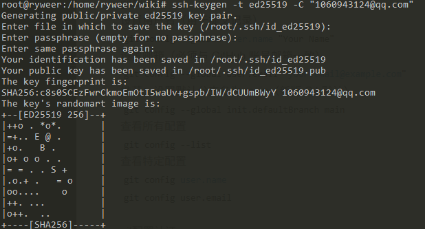
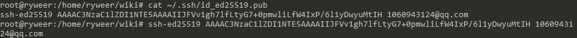
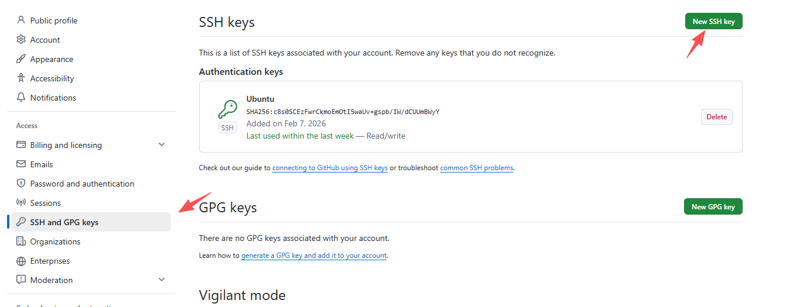
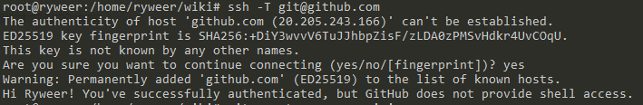

# Git使用
  - git安装
  <code>sudo apt install git</code>
  - git配置
  设置用户名（用于提交记录）
    <code>git config --global user.name "Your Name"</code>
    设置邮箱（必须与 GitHub 账号邮箱一致）
    <code>git config --global user.email "your.email@example.com" </code>
    推荐：设置默认分支名为 main（新版 Git 默认）
    <code>git config --global init.defaultBranch main</code>
    查看所有配置
    <code>git config --list</code>
    查看特定配置
    <code>git config user.name</code>
    <code>git config user.email</code>
    
  - git配置认证
    这里推荐使用SSH密钥认证。
    <b>步骤 1：生成SSH密钥</b>
    <code>ssh-keygen -t ed25519 -C "your.email@example.com"</code>
    

    <b>步骤 2：复制公钥</b>
    <code>cat ~/.ssh/id_ed25519.pub</code>
    

    <b>步骤 3：添加到 GitHub</b>
    登录 GitHub → Settings → SSH and GPG keys
    点击 New SSH key
    
    Title 填 Windows PC，Key 粘贴刚才复制的内容
    点击 Add SSH key

    <b>步骤 4：测试连接</b>
    <code>ssh -T git@github.com</code>
    成功提示：<code>Hi username! You've successfully authenticated...</code>
    
    
    <b>步骤 5：使用 SSH 地址推送</b>
    <code># 删除旧的 HTTPS 远程地址
    git remote remove origin
    \# 添加 SSH 地址（注意是 git@ 而非 https://）
    git remote add origin git@github.com:yourusername/yourusername.github.io.git
    \# 推送
    git push -u origin main</code>