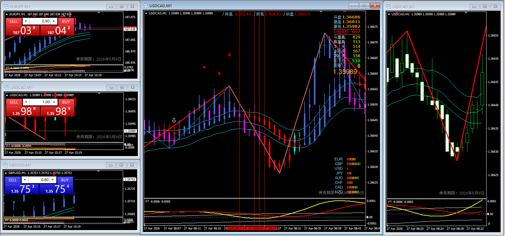
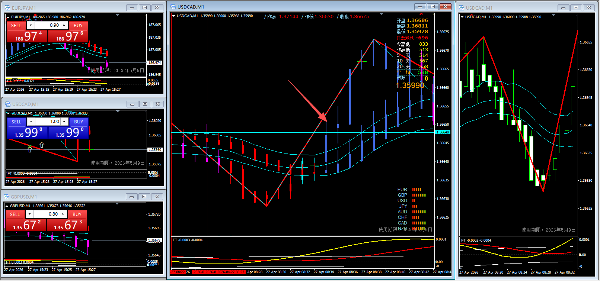
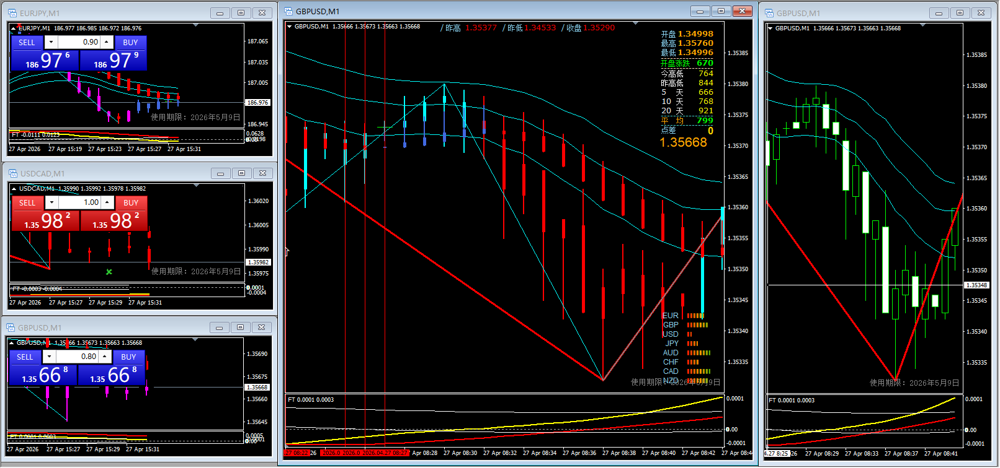
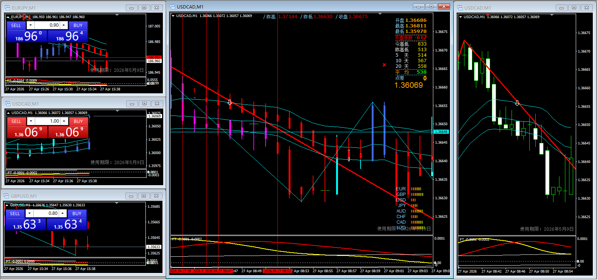
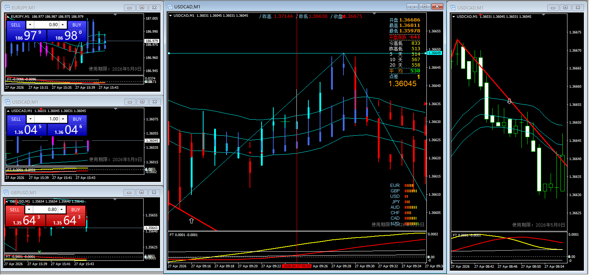
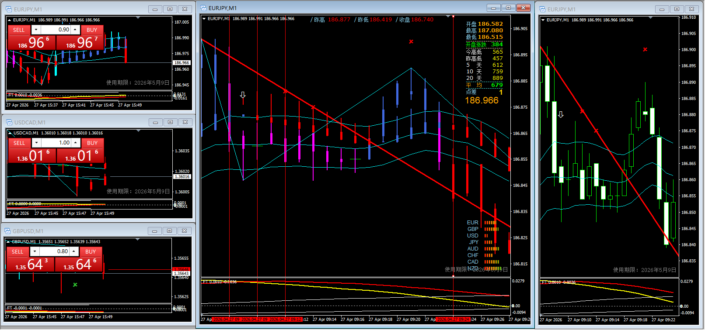
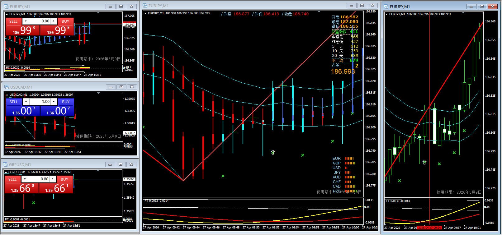
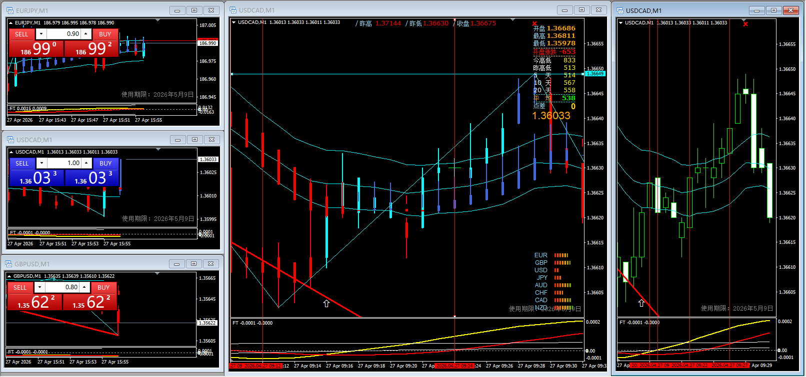
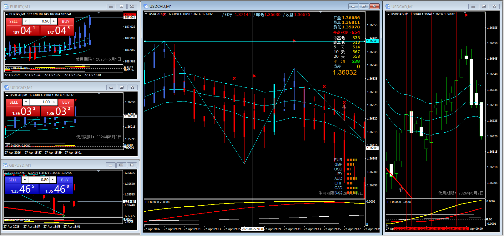

## 第一笔
### 进场

 - 姿势指标

|步骤|状态|
|---|----|
|手数确认|✔|
|红折线|✔|
|附图红线|✔|
|死叉 or 白箭头|✔|
|完成回抽|✔|
|三青线走势确认|✔|
|回抽完成后第一根红红收在下轨下|✔|
|是否标准进场点| ✔|

### 止损

止损原因
 - 出现蓝蓝且打破心理止损线

## 第二笔

 - 姿势指标
  
|步骤|状态|
|---|----|
|手数确认|✔|
|红折线|×|
|附图红线|×|
|死叉 or 白箭头|×|
|完成回抽|×|
|三青线走势确认|×|
|回抽完成后第一根红红收在下轨下|×|
|是否标准进场点| ×|

 - **错单**

## 第三笔
### 进场

 - 姿势指标

|步骤|状态|
|---|----|
|手数确认|✔|
|红折线|✔|
|附图红线|✔|
|死叉 or 白箭头|✔|
|完成回抽|✔|
|三青线走势确认|✔|
|回抽完成后第一根红红收在下轨下|✔|
|是否标准进场点| ✔|
### 出场

出场原因
 - 第一阶段完成出场，连续打破三青线上轨，判断后续出现看多走势

## 第四单
### 进场

 - 姿势指标

|步骤|状态|
|---|----|
|手数确认|✔|
|红折线|✔|
|附图红线|✔|
|死叉 or 白箭头|✔|
|完成回抽|✔|
|三青线走势确认|✔|
|回抽完成后第一根红红收在下轨下|✔|
|是否标准进场点| ✔|
### 出场

出场原因
 - 第一阶段完成出场，出现反向看多信号指标
  
## 第五单
### 进场

 - 姿势指标

|步骤|状态|
|---|----|
|手数确认|✔|
|红折线|✔|
|附图红线|×|
|死叉 or 白箭头|✔|
|完成回抽|✔|
|三青线走势确认|✔|
|回抽完成后第一根红红收在上轨上|✔|
|是否标准进场点| ×|

 - 问题分析
  入场时没注意到附图红线已经在0轴上方，错单

### 出场

出场原因
 - 保守止损，连续出现红红且打破三青线下轨

## 第六单
