## 今日总览
|品种|盈亏|
|---|---|
|XAUUSD|-3.4|
|BTCUSD|-41.1|
|XAUUSD|-115.2|
|XAUUSD|-12.3|
|BTCUSD|-20.4|
|XAUUSD|-16.05|
|BTCUSD|+13.2|
|XAUUSD|+11|
|总计|-190.25|
## 单子分析
### 第一单——XAUUSD空单
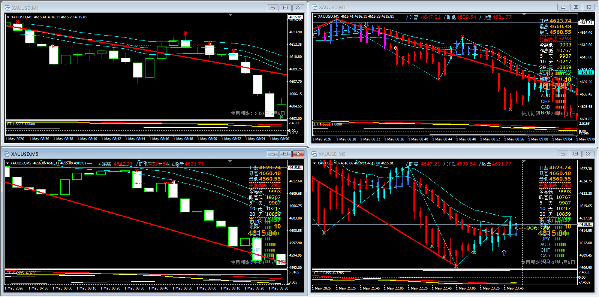
#### 姿势检查
|检查项|结果|
|---|---|
|是否标准进场|是|
|是否盈利|否|
|安全垫状态|无|

#### 盈利分析
当日第一个单子，进场点没问题，从结果上来看这单本身是会产生丰厚的利润的，最后微亏出场。

**问题总结**
 - 这单选择第一阶段完成出场，核心原因是担心行情反转，但未考虑技术指标。
 - 从1min和5min两个量级来看，当时附图的红线都在0轴上，说明总体趋势大概率还是空方的，此时不应该畏惧行情出现大反转，即使出现大反转也有硬止损兜底，这就是硬止损的作用。
 - 1min主图图出现了向下红折线，可能会出现反向进场点，但是行情大概率看空的前提下，即使出现反向标准进场点，思路也应该是微赚或者微亏出场，不应该因为害怕行情彻底反转就提前出场，毕竟还没满足标准进场点全部条件，在顶天立地那根线出场时错误的，是少应该在后一根出现**回抽完成**或继续回抽来判断是否应该出场。
 - 1min主图价格进行了短暂反抽，但在5min主图中甚至没有上模上轨，进一步辅证了整体行情下行还没出现反转明确信号的观点。

#### 单子总结
本应该在第一单构建一个厚实的安全垫，但是因为情绪化恐慌造成安全垫构建失败，这是不应该的，在决定出场前应对当前行情进行充分的判断，且在亏损不大的情况下，至少应该等到反向进场信号出现，或打了自己的心里止损线再平仓。没有成果构建安全垫也影响了后续单子的交易心态，可以说是今日亏损的最大原因。

### 第二单——BTCUSD多单
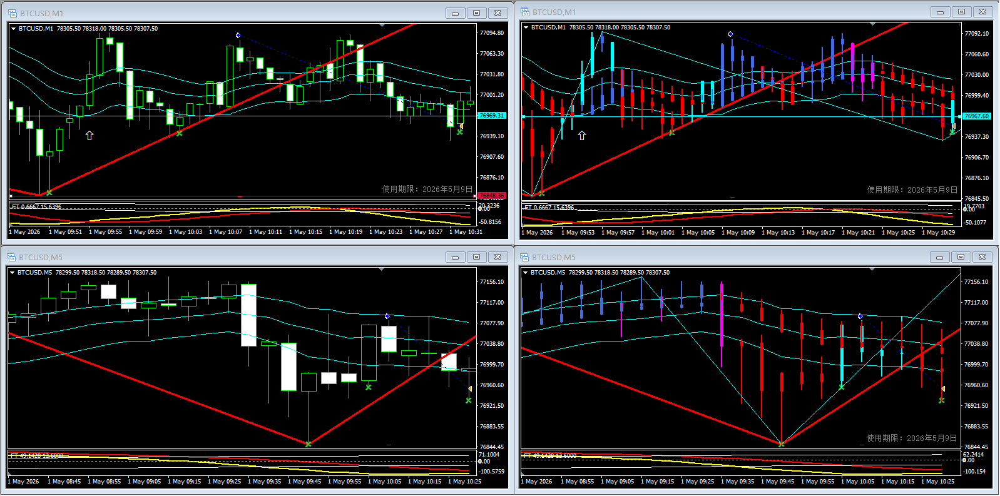
#### 姿势检查
|检查项|结果|
|---|---|
|是否标准进场|是|
|是否盈利|否|
|安全垫状态|无|

#### 盈利分析
当日第二个单子，进场点没问题，k线收破心里止损线，且是红红止损。
优点：止损有依据，不是情绪性止损
 - 1mink线复盘

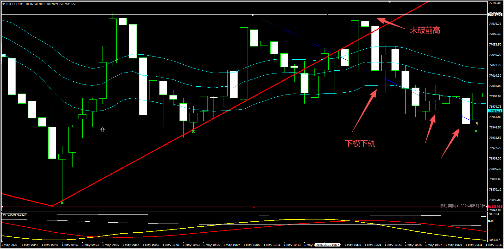
入场后再次出现回抽，且回抽后最高点没超过前高，所以向上红折线应该是没有出现的，认为多方势能并不强，且附图出现死叉信号，进一步认为空方势能较强。止损行为符合势能判断。

 - 5mink线复盘

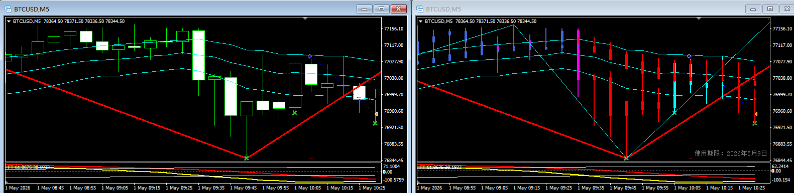
5min图中再上模上轨后已经完成回抽，但是回抽完成后再次回抽下探，这是考虑空方势能较强，存在创新低的可能性，止损行为符合势能判断。

**问题总结**
 - 无，虽然从结果上看这单能盈利，但是在止损时各种信号都指向继续下探的可能性，此时出场没有问题。

#### 单子总结
在第一单已经失败的前提下，本单选择大概率继续下探的情况下进行及时止损，且止损在红红收定在心里止损线下，操作没有问题，属于计划内亏损。

### 第三单——XAUUSD多单
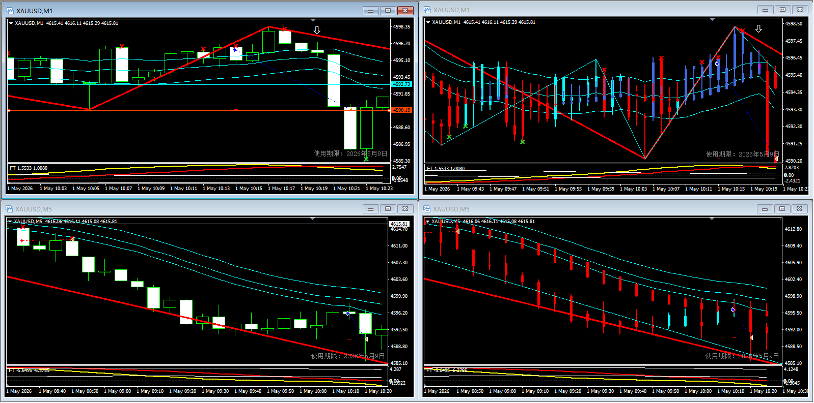
#### 姿势检查
|检查项|结果|
|---|---|
|是否标准进场|是|
|是否盈利|否|
|安全垫状态|无|

#### 盈利分析
进场点没问题，打了硬止损。
优点：止损有依据，不是情绪性止损
 - 1mink线复盘
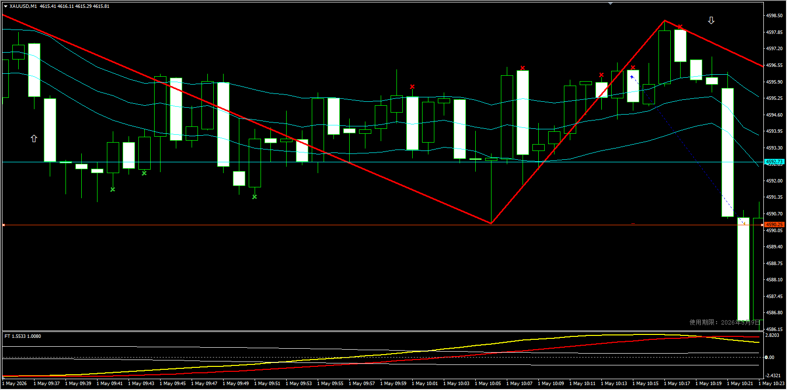
入场后直接强势回抽，直接打破了三青线下轨和心里止损线，距离硬止损只差一点点，这个时候没必要手动平仓，直接等他反弹或打硬止损就行。

 - 5mink线复盘
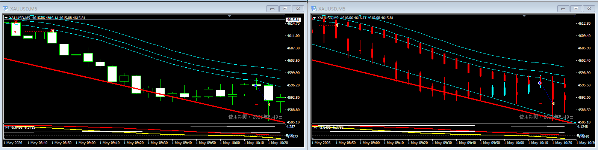
5min图中k线甚至没有上摸上轨，因此肯定时认定空方强势，就算没打硬止损也应该保守止损出场。

**问题总结**
 - 无，这单属于必亏单

#### 单子总结
本单是必亏单，没有优化空间。这里引出了一个场景，5min图可以看出k线虽然回到三青线下轨，但是没破中轨，在大周期内属于空方行情，没打硬止损的前提下应该在反弹过程中择高止损。

### 第四单——BTCUSD空单
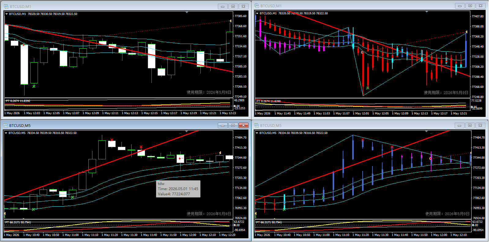

#### 姿势检查
|检查项|结果|
|---|---|
|是否标准进场|是|
|是否盈利|否|
|安全垫状态|无|

#### 盈利分析
进场点没问题，进场后出现向下红折线，属于第一阶段完成，出现了反向标准进场点，被迫离场。
优点：止损有依据，不是情绪性止损
 - 1mink线复盘

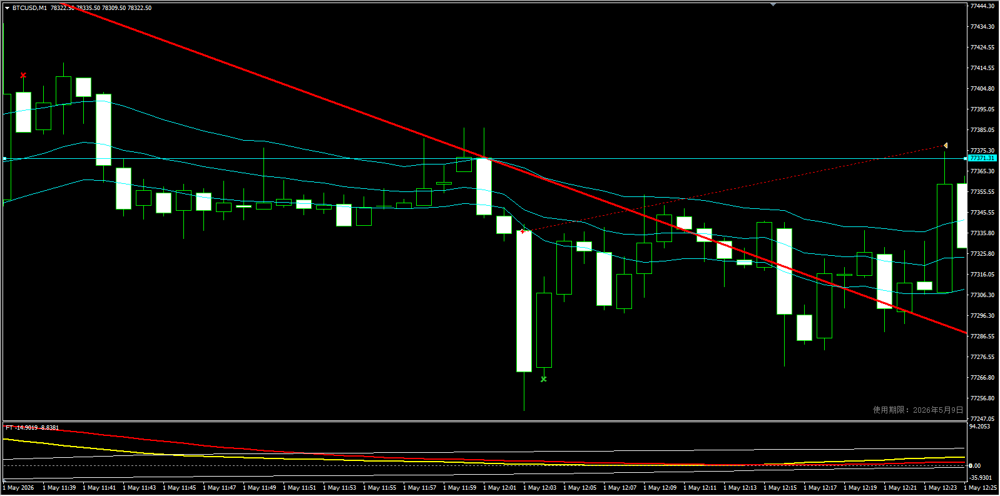
  - 附图红线在止损时再次金叉，依然是看多信号
  - 入场后价格又进行了回抽，且第二次下探低点低于入场最低点，判断空方势能不足，又出现了反向进场信号，在亏损不大的前提下选择微亏离场，决策上没啥问题。

 - 5mink线复盘
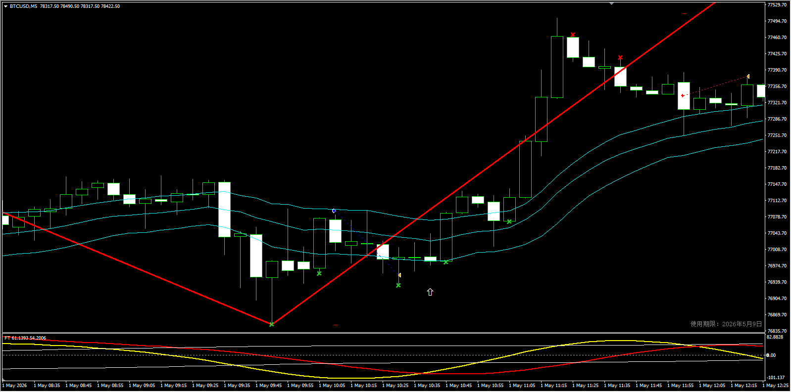
  - 5min图中k线只是摸了一下中轨，没有收破，说明空方势能不足，看多
  - 副图中出现死叉，说明又走空趋势

**问题总结**
 - 技术上，出现反向进场信号，属于被迫离场；但是5min图中始终没有强势下模下轨，因此看多权重高，在第一阶段完成的前提下，建议微赚离场。
 - 账户上，在没有安全垫的前提下，短期趋势看多，应该保证盈利离场

#### 单子总结
本单虽然在决策上没啥问题，不过还是存在可优化空间，虽然大趋势看多，但是5min图中既然出现了死叉，说明短期内大概率有一波回调，可以尝试吃短期回调的利润。如果判断行情确实会直接走多，在亏损不大的前提下，至少等新k线**收破心里止损线**再走。

### 第五单——XAUUSD多单
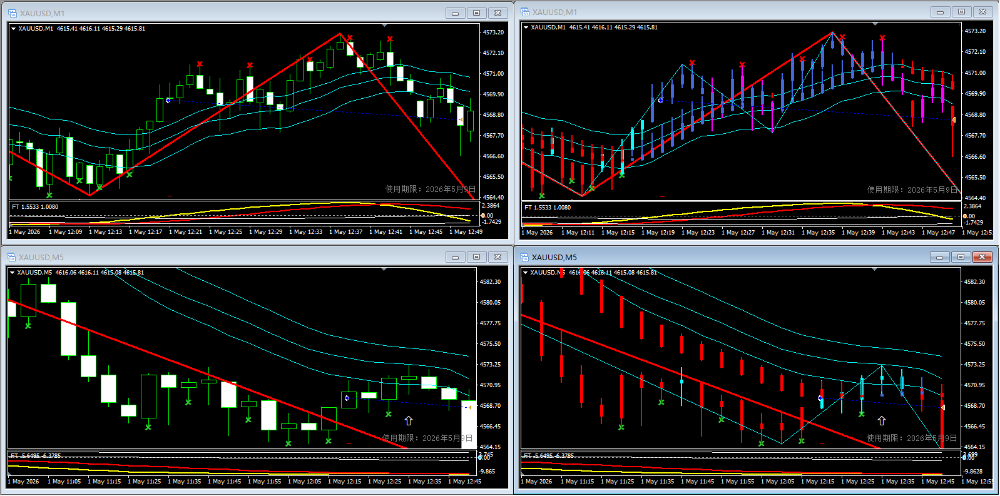

#### 姿势检查
|检查项|结果|
|---|---|
|是否标准进场|是|
|是否盈利|否|
|安全垫状态|无|

#### 盈利分析
第一阶段完成出场，期间有浮盈，单最后微亏离场，存在贪多心态。在第一阶段完成后，选择了一个反向进场点离场，操作上没问题。
 - 1mink线复盘

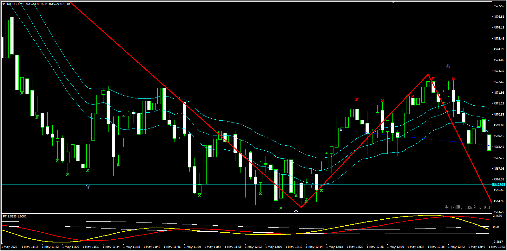
  - 附图红线在止损时死叉，出现空信号
  - 选择了在出现回抽开始，但没有回抽结束时止损，止损在回抽开始后出现顶天立地k线后，此时还无法判断回抽是否完成，是否有反向进场点，应该等下跟k线确定后再决定是否离场。

 - 5mink线复盘

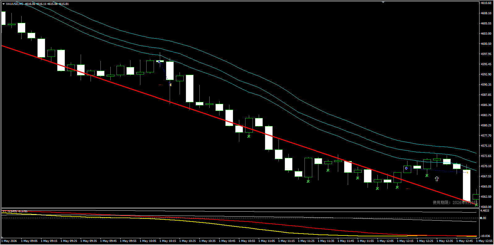
  - 5min图中k线只是摸了一下中轨，没有收破，说明多方势能不足，看空
  - 副图中出现金叉，看多，但是5min比1min滞后性大很多，所以k线表现权重高于附图指标权重，应该以k线表现优先。

**问题总结**
 - 止损依据不足
  如果预期在反向进场点离场，则应该在顶天立地后出现回抽结束信号时离场，毕竟这时候离心里止损线还远。

 - 在账户还在亏损
  5min中更偏向看空情况下，应尽量锁定利润，出了红折线新高后，择相对高点离场。

#### 单子总结
本单在离场时机上存在很大问题
 - 首先是应该在顶天立地线后一根确认回抽结束时离场
 - 在账户亏损时应该优先保利润，在出红折线后且当前看空情况下则高离场
 - 存在漏单问题，后面有个空单没进

### 第六单——BTCUSD多单
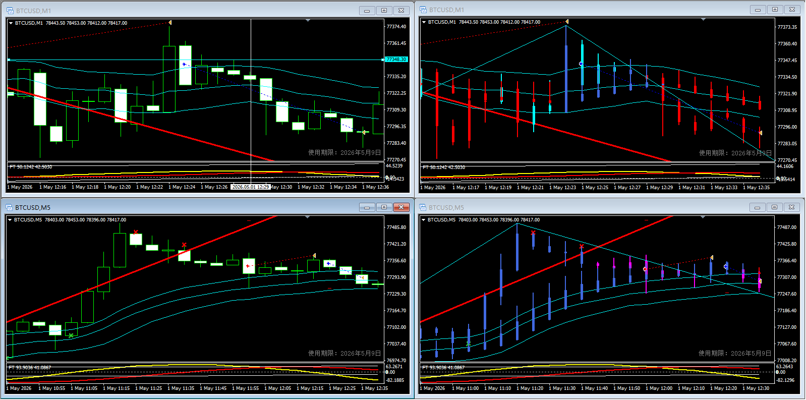

#### 姿势检查
|检查项|结果|
|---|---|
|是否标准进场|是|
|是否盈利|否|
|安全垫状态|无|

#### 盈利分析
保守止损离场，离场决策没有问题，但是时间节点有问题。
 - 1mink线复盘

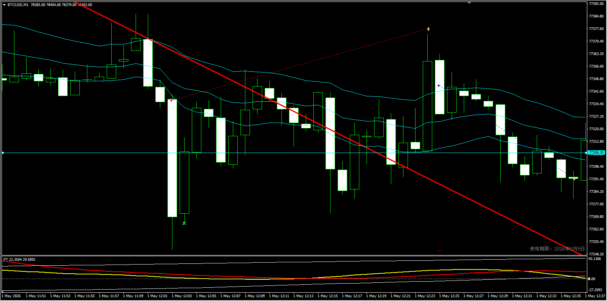
  - 附图红线在止损时死叉，出现空信号
  - 选择在持续新低后离场，时机上不对，既然已经死叉看空，前方k线还是持续下跌，应该在首次收破心里止损线时保守止损，当时已经出现红红了，可以直接离场，收窄亏损。

 - 5mink线复盘
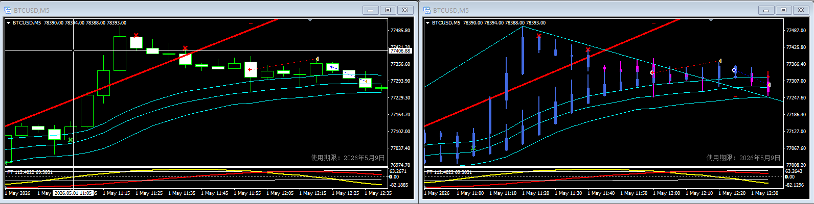
  - 5min图中已经死叉，出现空信号
  - 止损时已经k线还没有下模下轨，此时不能确认后续继续走空，但既然死叉在前几个k线就已经形成，看空信号已经确定，可能会回抽但趋势大概率向下，这种必须要做的单子应该首先考虑保守止损

**问题总结**
 - 止损时间节点不对
  本单下单时已经在5min中出现死叉，说明整体看空，应该及时止损不该等反弹或期望走多。

 - 在账户还在亏损
  5min中更偏向看空情况下，应第一时间保守止损，因为空方大于多方，没必要承担空方风险，后续可能会出现空方进场点。

#### 单子总结
本单在离场时机上存在很大问题
 - 首先是应该在第一次收破心里止损线时直接离场
 - 在账户亏损时应该在大趋势下给等待空间，逆大趋势下收窄亏损做单数。

### 第七单——XAUUSD空单
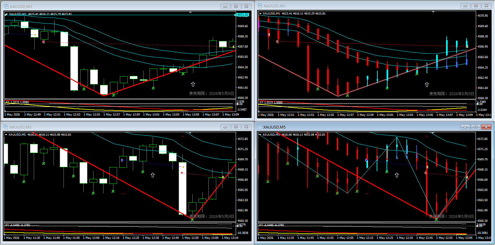

#### 姿势检查
|检查项|结果|
|---|---|
|是否标准进场|是|
|是否盈利|是|
|安全垫状态|无|

#### 盈利分析
第一阶段完成离场，浮盈回吐厉害，本身可以盈利100+usd，结果只盈利了13usd，出场时机有问题。
 - 1mink线复盘

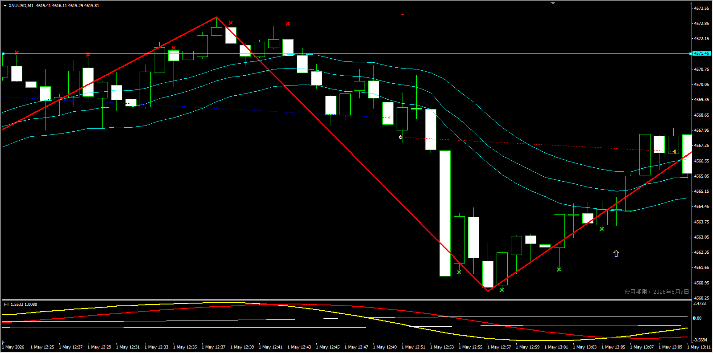
  - 附图红线在止损时金叉，出现多信号
  - 选择在突破三青线上轨离场，在账户未盈利的情况下不应该允许利润大幅回吐，13：02收定时就应该离场了，此时经历了回抽，小幅下跌后大幅回抽，在账户不盈利的情况下应该直接锁定利润离场。

 - 5mink线复盘

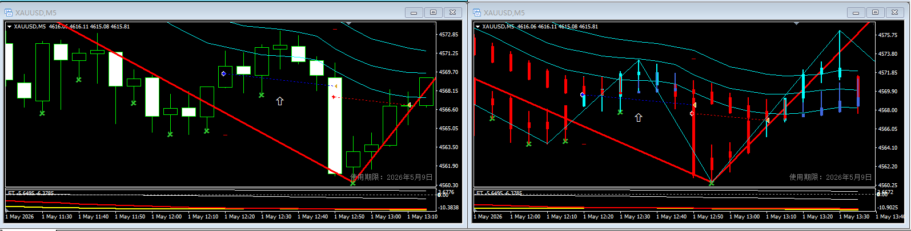
  - 5min图中已经金叉，出现多信号
  - 止损时还没上摸上轨，存在继续走空可能性

**问题总结**
 - 出场时间节点不对
  5min图中虽然k线没有上摸上轨，但是金叉已经形成，是存在走多可能性的，如果安全垫够厚的话是可以等一个回抽，但是在没有安全垫的前提下，应该优先锁定利润。

#### 单子总结
本单在离场时机上存在很大问题
 - 红折线已出，应该判断后续k线势能，k线达到新低后，连续大幅回升，小幅回抽后又大幅回升，这个时候就该走了。
 - 在账户亏损时应该在大趋势下给等待空间，逆大趋势下锁定盈利。

### 第八单——XAUUSD多单
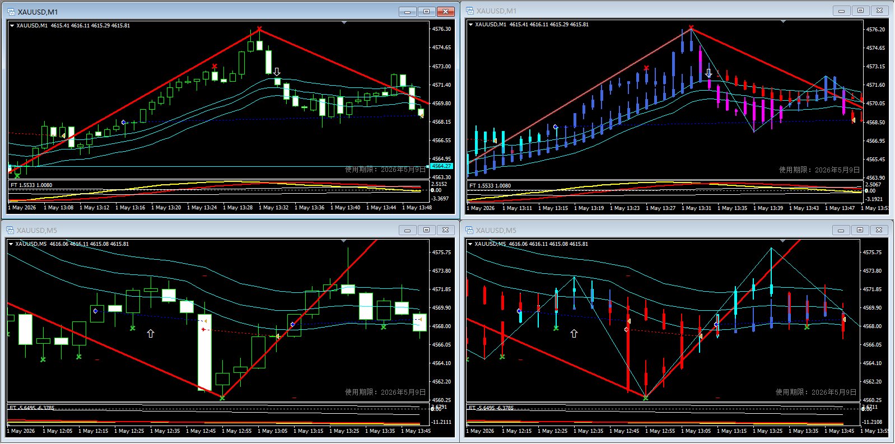

#### 姿势检查
|检查项|结果|
|---|---|
|是否标准进场|是|
|是否盈利|是|
|安全垫状态|无|

#### 盈利分析
第一阶段完成离场，浮盈回吐厉害，本身可以盈利150+usd，结果只盈利了11usd，出场时机有问题。
 - 1mink线复盘

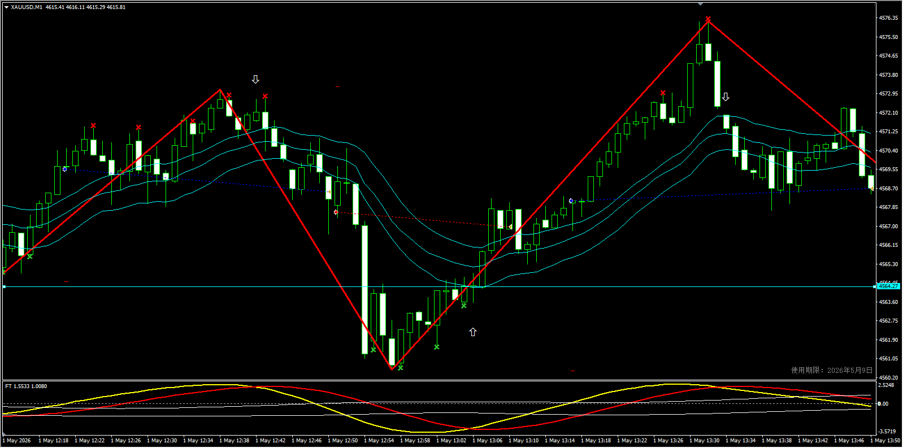
  - 附图红线在止损时已经死叉，出现空信号
  - 突破新高后，空方强势，2个k线吃掉了一倍的利润，在出现空方信号后考虑择高出场，应该考虑离场了。

 - 5mink线复盘

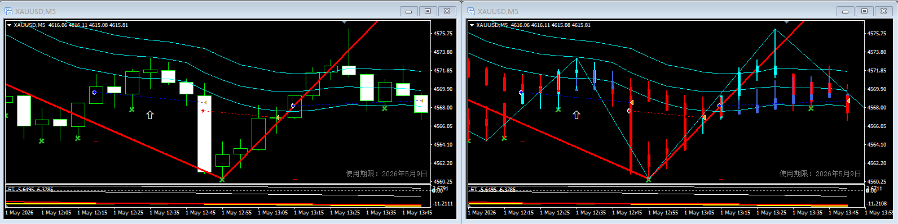
  - 5min图中金叉未明显形成，两根线还处于重叠状态
  - k线只是摸了一下中轨，金叉未成形，k线只摸了中轨，多方并不强势，不应该继续等待，后续很可能出现反向进场点，锁定利润才是关键

**问题总结**
 - 出场时间节点不对
  5min图中虽然k线没有上摸上轨，且金叉未形成，是存在走空可能性的，没有安全垫的前提下不该贪。

#### 单子总结
本单在离场时机上存在很大问题
 - 红折线已出，应该判断后续k线势能，k线达到新高后，连续大幅回撤，在一倍利润时就改走了。

## 今日交易总结
今天的账户反映了一个核心问题：
1、什么时候该等？等到什么时候？
2、什么时候该立马走？走的信号是什么？