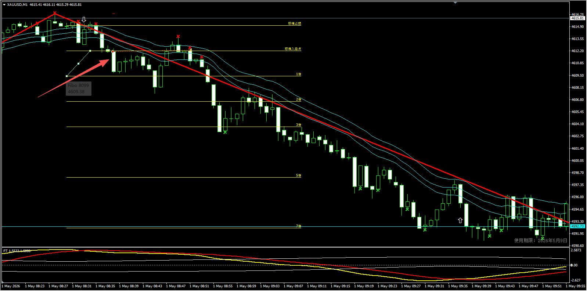
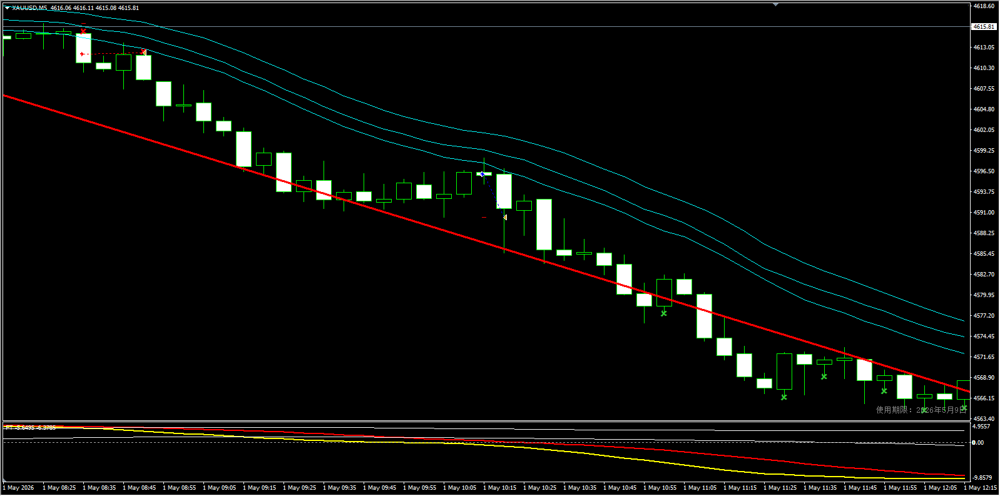
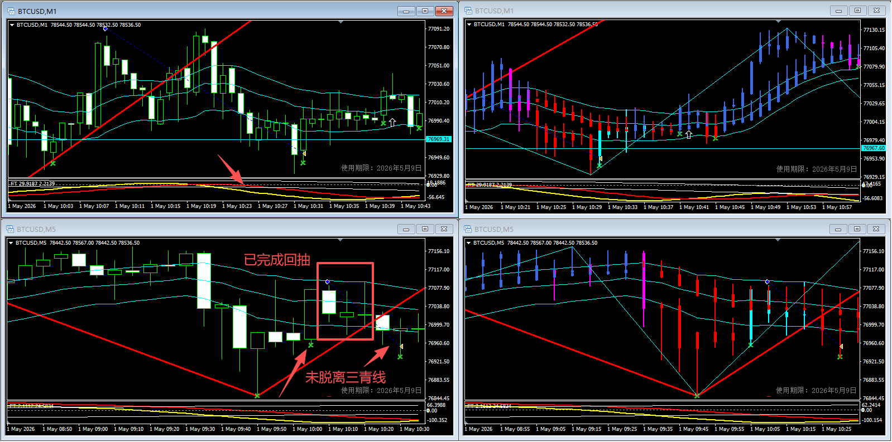
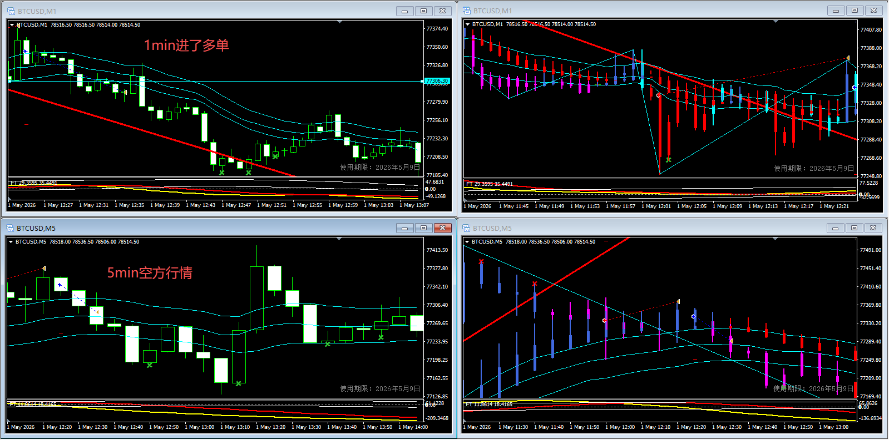

## 1、什么时候该贪？
### 1.1 1min和5min都在顺势周期内
 - 1min

 - 5min

 - 等待明确反向进场信号
 - 利润回吐1倍
 - 5min中反向上模上轨（下摸下轨）

### 1.2 进单方向与5min趋势相逆
但`5min`k线已经反向上摸上轨或下摸下轨，可以考虑贪。

 - `5min`k线反向摸轨
 - `5min`k线摸轨后已完成回抽
 - `1min` and `5min`k线未脱离三青线

## 2、什么时候不该贪？
### 进单方向与5min趋势相逆，且`5min`未出现反转信号

核心思想：微赚 or 微亏离场，逆势别想着贪
 - 收破心里止损线离场
 - 反向双色离场
 - 第一阶段完成后微赚离场

