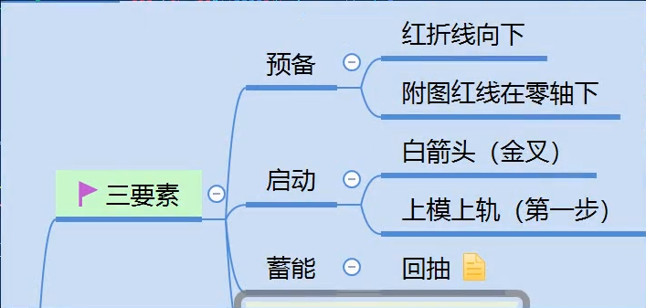
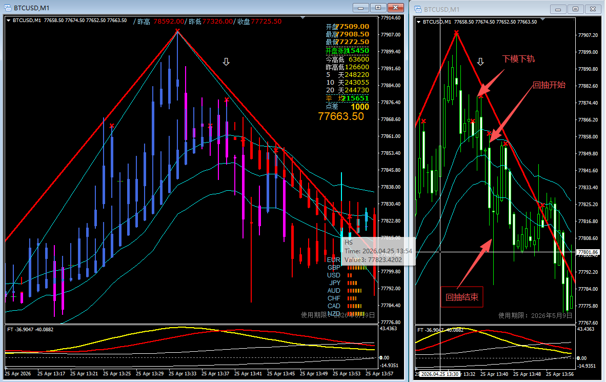
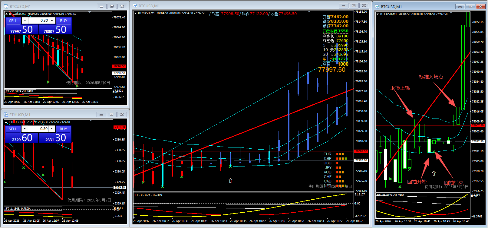
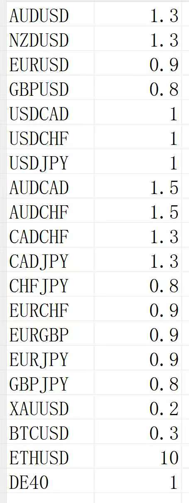

# 第一阶段知识点

## 1. 入场三要素

### 1.1 预备阶段
- 做空
  - 左侧出现向上红折线
  - 附图红线在零轴上
- 做多
  - 左侧出现向下红折线
  - 附图红线在零轴下

### 1.2 启动阶段
- 做空
  - 出现白箭头向下或附图死叉
  - 价格下摸下轨
- 做多
  - 出现白箭头向上或附图金叉
  - 价格上摸上轨

### 1.3 蓄能阶段
- 完成回抽结构

## 2. 回抽结构详解

### 2.1 做空回抽结构

#### 2.1.1 观察回抽开始节点
- 重点观察：下模下轨后的第1根K线（**含**）、第2根K线（**含**）以及回抽失效前的K线。

#### 2.1.2 回抽开始信号
- 从下模下轨后第2根K线（**含**）开始判断。
- 如果新K线**最低点**突破了从下模下轨后到当前K线前（**含下模下轨后第1根K线**）之间的最低价K线的最高点，则当前K线为回抽开始信号。

#### 2.1.3 回抽结束信号
- 当新K线的最低价突破自回抽开始所在K线（**含**）之后，最高价所在K线的最低价时，该K线即为回抽结束信号。

#### 2.1.4 标准进场点信号
- 从回抽结束信号所在K线（**含**）开始，第一根“红红”收定时进场。
- **若回抽结束信号与标准进场信号重合，则可在该K线收定后直接进场**。

### 2.2 做多回抽结构

#### 2.2.1 观察回抽开始节点
- 重点观察：上摸上轨后的第1根K线（**含**）、第2根K线（**含**）以及回抽失效前的K线。

#### 2.2.2 回抽开始信号
- 从上摸上轨后第2根K线（**含**）开始判断。
- 如果新K线**最低点**突破了从上摸上轨后到当前K线前（**含上摸上轨后第1根K线**）之间的最低价K线的最低点，则当前K线为回抽开始信号。

#### 2.2.3 回抽结束信号
- 当新K线的最高点突破自回抽开始所在K线（**含**）之后，最低价所在K线的最高价时，该K线即为回抽结束信号。

#### 2.2.4 标准进场点信号
- 从回抽结束信号所在K线（**含**）开始，第一根“蓝蓝”收定时进场。
- **若回抽结束信号与标准进场信号重合，则可在该K线收定后直接进场**。

### 2.3 顶天立地详解

## 3.标准进场点条件确认
 - 手数确认
 - 红折线确认，红折线未更新
 - 附图红线确认
 - 金叉或死叉 or 白箭头确认
 - 完成回抽
 - 三青线走势确认
 - 回抽完成后第一根红红收在下轨下（做空），第一根蓝蓝收在上轨上（做多）

## 手数参考表

