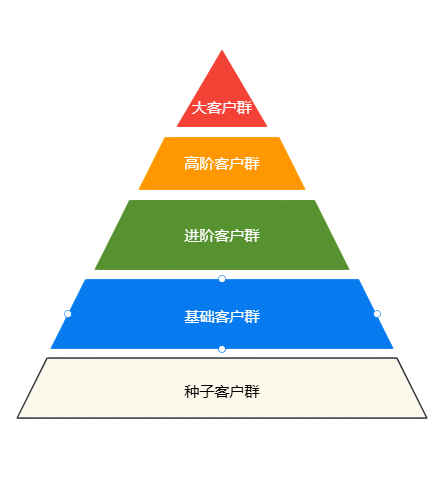
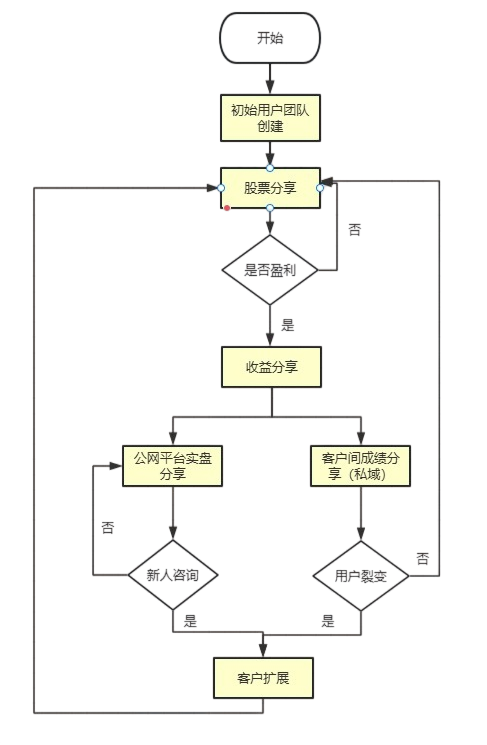

## 整体项目架构


## 客户群体划分



目前将客户整体分为5个等级：

| 客户等级 |                           等级定义                           | 入群资金门槛 | 交易频率门槛 |
| :------: | :----------------------------------------------------------: | :----------: | :----------: |
| 种子客户 | 预备客户群，接纳各渠道进来的客户，<br>定位为福利分享，粘性维护，优质客户筛选 |      0       |      0       |
| 基础客户 |              正式付费客户群，特点为微小资金群体              |    0-30万    |    1次/月    |
| 进阶客户 |    由基础客户群中进一步筛选的优质客户，具备一定的资金体量    |   30-60万    |    2次/月    |
| 高阶客户 |   由进阶客户群中进一步筛选的高质量客户，具备较大的资金体量   |   60-200万   |    4次/月    |
|  大客户  |    具备大资金的客户，操作风格由自主投资转变为私募代理    |  200万以上   |      -       |


## 变现方式

目前变现方式主要分为两个渠道：门槛费和利润抽成

### 利润抽成

抽成标准： 投资实际产生利益的**20%**。

### 门槛费

门槛费计算基础公式

```
门槛费用 = 资金体量基数（按等级区分） * 单次投资仓位比例 * 预期保守收益率 * 抽成比例 * 返利后实际抽成比例
```

门槛费收费标准

| 客户阶级   | 门槛费用（元/月） | 计算方式                                                     |
| ---------- | :---------------: | ------------------------------------------------------------ |
| 种子客户群 |         0         | -                                                            |
| 基础客户群 |        120        | 10w（取众数）\* 30%（单次仓位控制）\*  3%（保守收益率）* 20%（抽成比例） * 75%（返利后实际抽成） =  135 |
| 进阶客户群 |        400        | 30w（门槛下限）\*30%（单次仓位控制）\* 3%（保守收益率）* 20%（抽成比例） * 75%（返利后实际抽成） =  405 |
| 高阶客户群 |        800        | 60w（门槛下限）\*30%（单次仓位控制）\* 3%（保守收益率）* 20%（抽成比例） * 75%（返利后实际抽成） =  810 |
| 大客户群   |         0         | 由深圳方面返点                                               |

## 获客方式

获客主要分为两个阶段，三个路径。

### 第一阶段：初始客户群体构建

通过自身关系网拉拢第一波原始客户。

客户福利：**免门槛费**，**只进行利润抽成**

### 第二阶段：持续扩展客户群体

第二阶段主要分类三个路径实现客户拓展

**1、客户自主裂变**（效果+忠诚激励）

通过现有客户主动拉新客户进群，通过返利机制对忠诚用户进行奖励

|      上级拉新奖励      |                    下级新入群奖励                     |
| :--------------------: | :---------------------------------------------------: |
| 持续获得下级收益5%返点 |            通过引荐机制进群可免当月门槛费             |
|                       | 第一支盈利股票只抽成10% |

**2、社交平台引流**

通过小红书，微信公众号，豆瓣等平台进行实盘操作分享，吸引潜在客户加种子群转私域

**3、第三方合作**

联合各大券商，银行等金融行业，沟通具体合作方式。

### 实施思路



## 客户运营

客户运营的目的主要是维护用户粘性，筛选优质客户，主要涉及一下几个方式。

| 客户等级   | 运营方式                                                     |
| ---------- | ------------------------------------------------------------ |
| 种子客户群 | 福利股票推荐（免费）（1票/周）<br>收益分享<br>投资理念分享，加强仓位控制意识和风险操作教育 |
| 基础客户群 | 收益分享<br>投资理念分享，加强仓位控制意识和风险操作教育<br/>节假日礼品 |
| 进阶客户群 | 收益分享<br/>投资理念分享，加强仓位控制意识和风险操作教育<br/>节假日礼品 |
| 高阶客户群 | 收益分享<br/>投资理念分享，加强仓位控制意识和风险操作教育<br>节假日礼品 |
| 大客户群   | 节假日礼品（如有）                                           |

