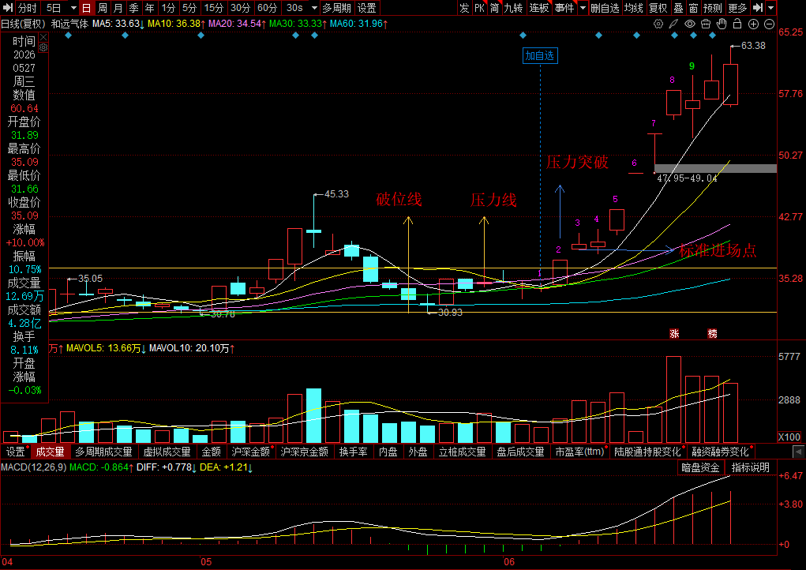
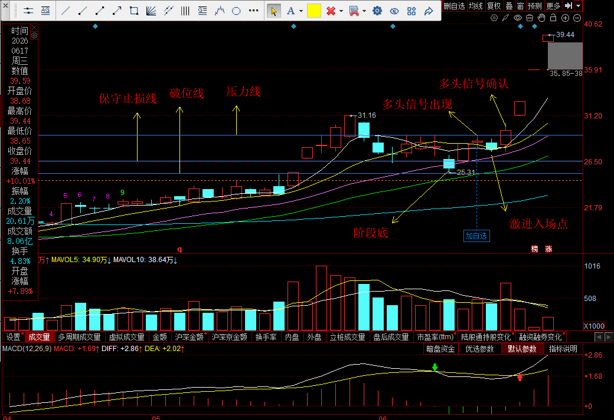
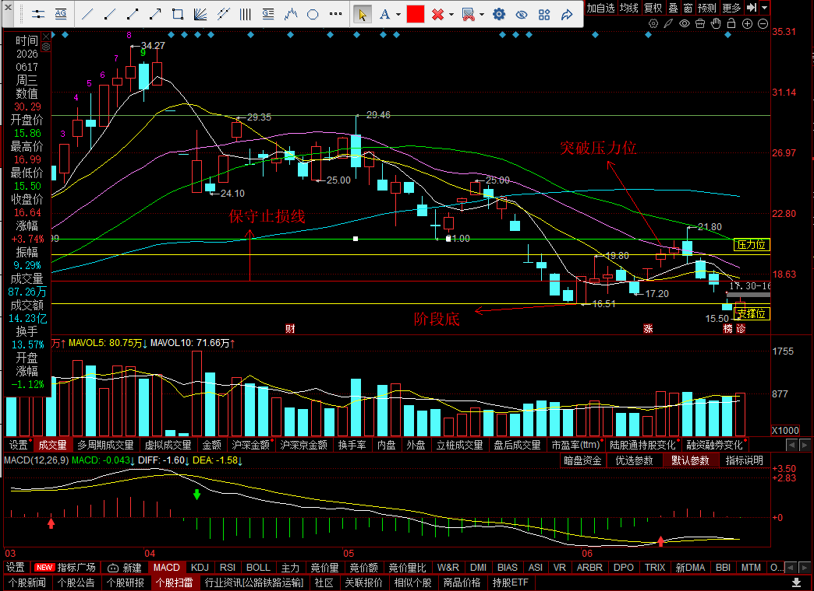
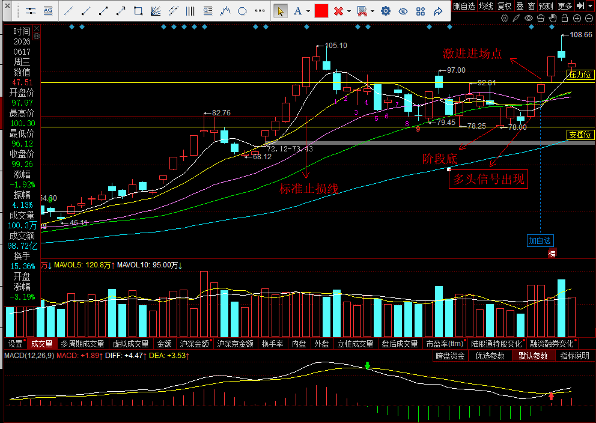
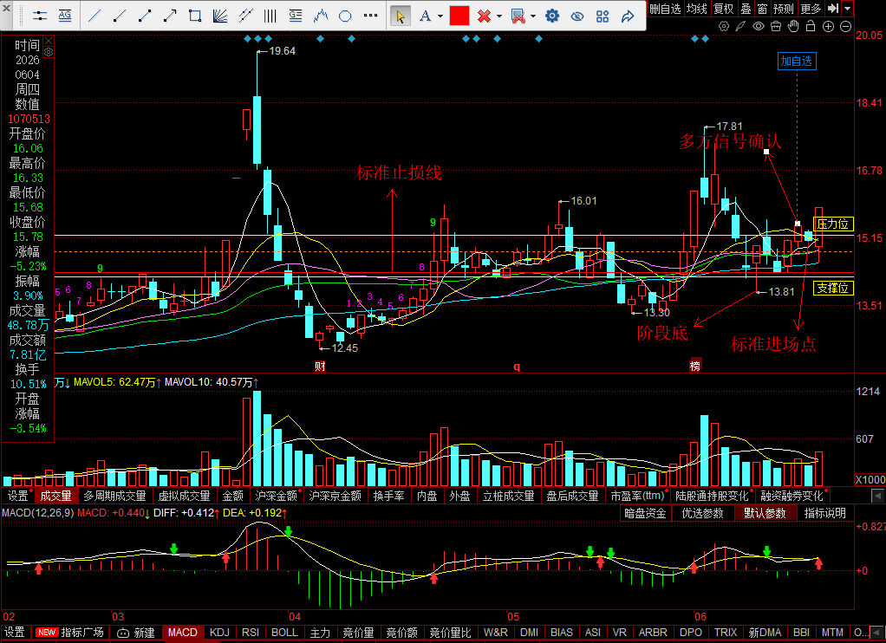

## 0605
### 002971 和远气体

### 趋势分析
当前整体处于多方市场，均线呈多头分布，满足策略基本逻辑。
#### 进场策略：多头回抽后重新突破（标准进场）
0518 --> 出现顶信号，股价开始回调; 
0526 --> 出现阶段底，股价开始横盘整理； 
0604 --> 股价突破压力线收定，且价格收定在所有均线上方，多方势头确立； 
0605 --> 标准进场点建仓；
#### 出场策略：强势多头场景下，分批止盈
0610 --> 收益率大幅超过标准止盈点5%，当日标的一字板，多头强势，减仓一半锁定收益； 
0611 --> 标的一字板过程中开板，判断多方控盘能力不足，平仓离场，落袋为安。
#### 交易复盘
符合交易策略，出场时机事后看有点早，但收益已远超预期的前提下，锁定收益才是主要目标。

## 0611
### 002741 光华科技

#### 趋势分析
均线呈多头分布，整体处于多方市场，满足策略基本逻辑。
#### 进场策略：多头回抽后出现多头信号，但未突破压力线（激进进场）
0529 --> 出现顶信号，股价开始回调； 
0602 --> 出现阶段底，标的开始尝试突破，但未站稳均线上，多方信号确认失败； 
0608 --> 再次确认阶段底，后续价格出现强势反弹； 
0610 --> 股价站稳所有均线上方，并伴随成交量放大，多头信号已经出现，但是价格未突破压力线，多头趋势并未确认； 
0611 --> 激进进场点建仓；
#### 出场策略：强势多头场景下，分批止盈
0612 --> 股价突破压力线并收定，此时多头趋势已经确定，此时以达到标准止盈条件，但考虑到多方行情刚刚开始，后续大概率还有盈利空间，所以只减了25%的仓位保成本； 
0615 --> 强势涨停，中途未炸板，再次减仓25%，分批止盈； 
0616 --> 一字板，中途未开板，多方依旧强势，继续持有； 
0617 --> 强势涨停，中途未开版，多方依旧强势，继续持有；
#### 交易复盘

### 603778 国晟科技

#### 趋势分析
 - 均线呈空头分布，整体处于空方市场，**不满足**策略基本逻辑。
 - 下跌过程中不断出现更低的低点和更低的高点，空方势能已经形成。
#### 进场策略：空头阶段性反弹，突破压力位（错误进场）
0410 --> 出现顶信号，价格开始回落； 
0601 --> 第三次出现阶段底； 
0610 --> 突破最近的压力位，出现反弹信号； 
0611 --> 低吸入场建仓
#### 出场策略：标准止损
0612 --> 达到标准止损线止损离场
#### 交易复盘
##### 问题
 - 问题1：忽略大趋势，A股只能做多，所以标的大趋势必须是多头
 - 问题2：对压力位的理解过于片面，虽然突破了短期压力位，但对于已经走坏的趋势，压力之上还有压力，抛压严重，反转概率非常低，除非出现天量成交量
 - 问题3：没关注均线支撑点，从前面的走势可以看出，股价每次回摸20日均线后，都出现了反转下行，突破压力位的位置正好是回摸20日均线的位置，此时风险已经暴露，不应该进场
##### 优点
 - 止损果断，收盘前已经确定趋势走坏且已经接近标准止损线，果断进行了止损，不扛单。

## 0615 
### 002428 云南锗业

#### 趋势分析
均线呈多头分布，整体处于多方市场，满足策略基本逻辑。
#### 进场策略：多头回抽后出现多头信号，但未突破压力线（激进进场）
0514 --> 出现顶信号，价格开始回落； 
0608 --> 出现阶段底；后续股价开始反弹； 
0611 --> 放量涨停，股价收定在所有均线上方，多头信号出现； 
0612 --> 出现多头信号后并未突破压力位，出现激进进场点； 
0615 --> 高开强势突破压力位，在当日走势低位建仓进场；
#### 出场策略：出现顶信号，风控出场
0616 --> 价格已达到止盈标准，在中场先减仓50%构建安全垫，后续行情走出阴包阳，价格冲高7个点后回落至减仓价格以下，判断出现顶信号，清仓离场。
#### 交易复盘
##### 问题
进场时间不对，激进进场的时间在6月12日，不过当时还在调整公式，没筛选出来，不属于技术问题。 
需要注意的是：激进进场必须在尾盘或第二天择机进场，不可以在激进进场点早盘进。
##### 优点
离场策略合理，平仓果断。

## 0616
### 000722 湖南发展

#### 趋势分析
均线呈多头分布，整体处于多方市场，满足策略基本逻辑。
#### 进场策略：多头回抽后重新突破（标准进场）
0602 --> 出现顶信号，股价开始回落； 
0609 --> 出现阶段底，后续开始尝试回升； 
0615 --> 价格突破压力位，且收定在所有均线上方，多方信号确立； 
0616 --> 低吸标准进场建仓； 
0617 --> 开盘急速下探回踩60日均线，判断60日均线为强支撑，因此做T降成本，后续价格符合预期回升，做T成功。