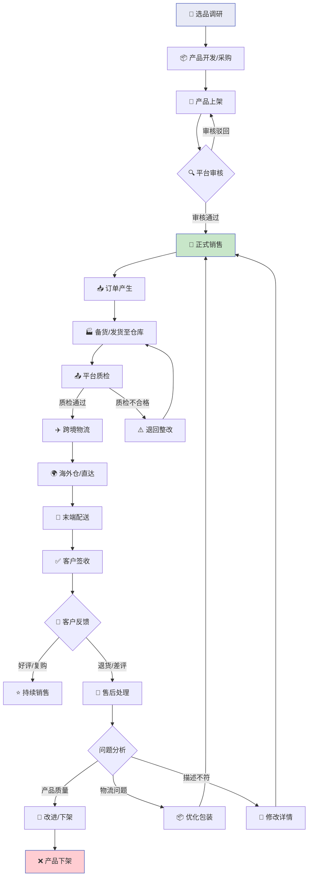

# TEMU 运营实战手册

> 📅 最后更新：2024-05-22  
> 👤 维护者：RYWEER  
> 🔗 仓库：[GitHub](https://github.com/你的用户名/你的仓库)

---

## 📋 目录
- [TEMU 运营实战手册](#temu-运营实战手册)
  - [📋 目录](#-目录)
  - [TEMU选品逻辑](#temu选品逻辑)
  - [📊 Temu 产品生命周期流程图](#-temu-产品生命周期流程图)
  - [TEMU 成本构成](#temu-成本构成)
  - [TEMU 定价逻辑](#temu-定价逻辑)
    - [核心公式](#核心公式)
    - [案例演算](#案例演算)
    - [核价安全区间](#核价安全区间)
  - [🔄 版本记录](#-版本记录)

---

## TEMU选品逻辑

temu选品有两种思路，详情见下方表格

| 思路 | 详细 | 优劣点 |
|------|------|--------|
| 热点跟卖 | 根据当下市场热卖商品，快速上品，极速开卖 | 1️⃣ 滞后性 2️⃣ 易限流 3️⃣ 核价难 |
| 长青款 | 寻找生活中常用的品类（例如生活类服饰） | 1️⃣ 起量慢 2️⃣ 易滞销 3️⃣ 资金周转慢 |

> 💡 **策略建议**：新手建议从「长青款」起步，稳定后再尝试「热点跟卖」。

---

## 📊 Temu 产品生命周期流程图

---

## TEMU 成本构成

| 成本项 | 说明 | 占比参考 |
|:-------|:-----|:--------:|
| 采购成本 | 商品本身的采购成本 | 50%~70% |
| 包装成本 | 更换包装、贴标、质检等费用 | 3%~8% |
| 物流成本 | 头程 + 尾程物流费用 | 15%~25% |
| 折扣成本 | 平台活动让利成本 | 5%~15% |
| 推广成本 | 流量推广分摊费用 | 3%~10% |

> 💡 **综合成本公式**：
> $$
> C_{total} = C_{buy} + C_{pack} + C_{ship} + C_{discount} + C_{promo}
> $$

---

## TEMU 定价逻辑

### 核心公式

$$
\text{最终售价} = \frac{C_{total}}{1 - R_{target}} \tag{1}
$$

其中：
- $C_{total}$ = 综合成本
- $R_{target}$ = 目标利润率（以成交价为基线）

### 案例演算

**场景**：综合成本 20 元，期望利润率 50%

✅ **正确算法**：
$$
\text{售价} = \frac{20}{1 - 0.5} = 40 \text{ 元}
$$
- 实际利润率：$(40-20)÷40 = 50\%$ ✅

❌ **错误算法**：
$$
\text{售价} = 20 \times (1 + 0.5) = 30 \text{ 元}
$$
- 实际利润率：$(30-20)÷30 ≈ 33.3\%$ ❌

---

### 核价安全区间

| 项目 | 计算方式 | 建议值 |
|:-----|:---------|:------:|
| 目标利润率 | $R = \frac{P - C}{P}$ | ≥ 40% |
| 安全边际 | 预留活动折扣空间 | +10%~20% |
| 最低成交价 | $P_{min} = \frac{C}{1 - R - S}$ | — |
| 建议上架价 | $P_{list} = P_{min} \times 1.1$ | — |

**示例**（成本 20 元，目标利润率 40%，安全边际 20%）：

$$
P_{min} = \frac{20}{1 - 0.4 - 0.2} = 50 \text{ 元}
$$

$$
P_{list} = 50 \times 1.1 = 55 \text{ 元}
$$

> 📌 **操作清单**：
> 1. [ ] 核价申报：**50 元**
> 2. [ ] 上架设置：**55 元**（预留 5 元活动空间）
> 3. [ ] 活动后成交价 ≥ 44 元，仍保 40%+ 利润率

---

## 🔄 版本记录

| 版本 | 日期 | 修改内容 |
|------|------|---------|
| v1.0 | 2024-05-22 | 初始版本：选品 + 生命周期 + 定价 |
| v1.1 | TBD | 待补充：退货率成本模型、批量核价工具 |