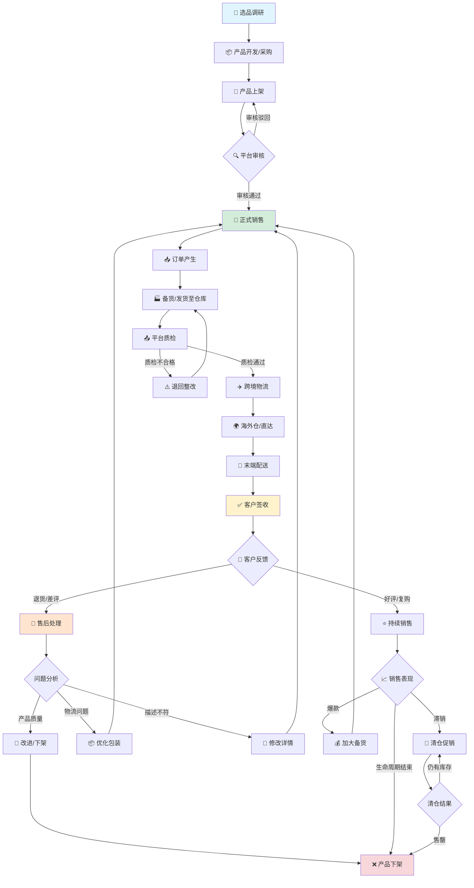

## TEMU选品逻辑
temu选品有两种思路，详情见下方表格

|思路|详细|优劣点|
|---|---|---|
|热点跟卖|根据当下市场热卖商品，快速上品，极速开卖|1、滞后性 2、易限流 3、核价难
|长青款|寻找生活中常用的品类（例如生活类服饰）|1、起量慢 2、易滞销 3、资金周转慢|

---

## 📊 Temu 产品生命周期流程图

## TEMU 成本构成

TEMU 的成本构成主要有以下几方面：

| 成本项     | 说明                                                                 |
|:-----------|:---------------------------------------------------------------------|
| 采购成本   | 商品本身的采购成本                                                   |
| 包装成本   | 更换商品包装、贴标、质检等产生的费用                                 |
| 物流成本   | 包含供应商到国内仓的头程物流 + 备货到平台海外仓的尾程物流费用         |
| 折扣成本   | 报名平台活动（如秒杀、满减）产生的让利成本                           |
| 推广成本   | 平台流量推广分摊费用（按订单比例收取）                               |

> 💡 **提示**：综合成本 = 采购成本 + 包装成本 + 物流成本 + 折扣成本 + 推广成本

---

## TEMU 定价逻辑

在明确产品的成本构成后，定价公式如下：

$$
\text{最终售价} = \text{综合成本} + \text{目标利润}
$$

### 利润率计算标准

商品利润率应以 **平台实际回款（成交价）** 为基线计算，而非成本价：

$$
\text{商品利润率} = \frac{\text{实际利润}}{\text{商品成交价}} \times 100\%
$$

### 定价案例

**场景**：商品综合成本 20 元，期望利润率 50%

✅ **正确算法**（以成交价为基线）：

$$
\text{售价} = \frac{\text{成本}}{1 - \text{目标利润率}} = \frac{20}{1 - 0.5} = 40 \text{ 元}
$$

- 平台回款：40 元
- 实际利润：40 - 20 = 20 元
- 实际利润率：20 ÷ 40 = 50% ✅

❌ **错误算法**（以成本为基线）：

$$
\text{售价} = \text{成本} \times (1 + \text{目标利润率}) = 20 \times (1 + 0.5) = 30 \text{ 元}
$$

- 平台回款：30 元
- 实际利润：30 - 20 = 10 元
- 实际利润率：10 ÷ 30 ≈ 33.3% ❌（远低于预期）

> ⚠️ **关键结论**：必须使用 **成交价基线法** 定价，否则实际利润率将大幅低于预期！

---

### 核价安全区间

平台核价时建议预留安全边际：

| 项目             | 计算方式                              | 建议比例 |
|:-----------------|:--------------------------------------|:--------:|
| 目标利润率       | 利润 ÷ 成交价                         | ≥ 40%    |
| 安全边际         | 预留应对活动折扣的空间                | +10%~20%  |
| 最低成交价       | 成本 ÷ (1 - 目标利润率 - 安全边际)    | —        |
| 建议上架价       | 最低成交价 × 1.1（预留促销空间）      | —        |

**示例**（成本 20 元，目标利润率 40%，安全边际 20%）：

$$
\text{最低成交价} = \frac{20}{1 - 0.4 - 0.2} = \frac{20}{0.4} = 50 \text{ 元}
$$

$$
\text{建议上架价} = 50 \times 1.1 = 55 \text{ 元}
$$

> 📌 **操作建议**：
> 1. 核价时按 **50 元** 申报
> 2. 上架时设置 **55 元**，预留 5 元活动折扣空间
> 3. 参与 20% 活动后实际成交价 44 元，仍能保证 40%+ 利润率
>
